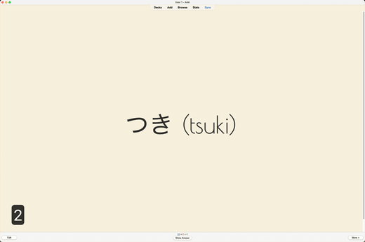
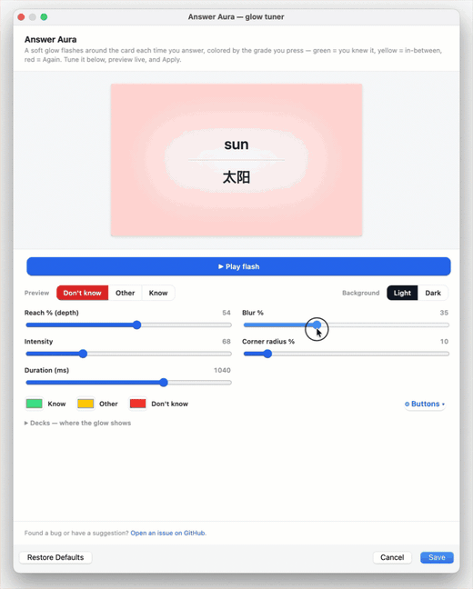

# ✨ Answer Aura

You tap an answer button, the next card slides in… and a second later you catch yourself thinking *"wait — did I actually get that one right?"* 🤔

I built Answer Aura because that kept happening to me. Now the moment you answer, a soft glow washes over the card in the color of your grade:

- 🟢 **Green** — you knew it
- 🟡 **Yellow** — so‑so
- 🔴 **Red** — Again

It's gone by the time the next card shows up. You don't really read it, you just kind of feel how the card went.

<!-- change width to resize -->

## Make it yours 🎛️

Open **Tools → Answer Aura — glow tuner** (or the add‑on's **Config** button), drag the sliders, and watch the live preview — it matches your real cards exactly. Happy with it? Hit **Save**. That's it — no restart, no config files.

<!-- change width to resize -->

What you can tune:

- 🎨 **Colors** — pick your own for each grade
- 🌫️ **Reach, blur, intensity, corners** — from a whisper‑thin edge to a full‑card wash
- 🎯 **Grades** — decide which Anki button (Again / Hard / Good / Easy) shows which color, or switch some off entirely
- 📚 **Decks** — turn the glow off in the decks where you don't want it (master toggle + per‑deck)

## Good to know

The glow follows the **grade you record**, not a specific key, so it works whether you answer with number keys, an hjkl add‑on, or the mouse. By default Again is red and the rest are green, with yellow waiting for whatever you map to it.

## 🐞 Found a bug or have an idea?

Open an issue → https://github.com/privetyaolega/anki-answer-aura/issues

That's the whole idea. Now go do your reps.

## License

MIT
